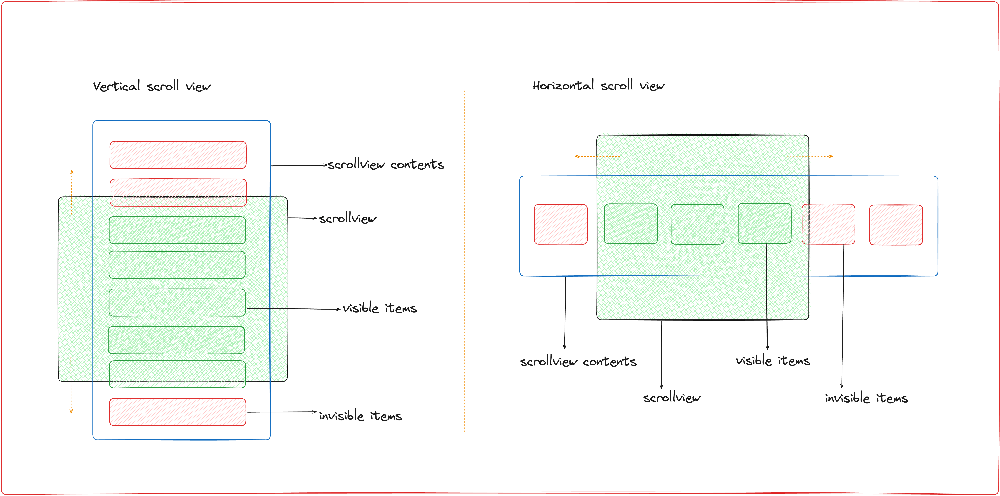

# Scroll Viewport Tracker

A react-native util to track elements inside a scrollable view. Uses custom state handlers to minimize re-renders, and optimizes for performance.



### Works with

- ScrollView
- FlatList
- SectionList

## Installation

```sh
npm install rn-scroll-viewport-tracker
```

## Usage

```js
import {
  ScrollViewPortTracker,
  ScrollViewPortAwareView,
} from 'rn-scroll-viewport-tracker';

<ScrollViewPortTracker>
  <ScrollView>
    <Component1 />

    <ScrollViewPortAwareView
      name="component2"
      onEnterViewport={() => console.log('component 2 entered viewport')}
      onLeaveViewport={() => console.log('component 2 left viewport')}
    >
      <Component2 />
    </ScrollViewPortAwareView>

    <Component3 />
  </ScrollView>
</ScrollViewPortTracker>;
```

## ScrollViewPortTracker Props

| Prop Name           | Type    | Default | Description                                                                                         |
| ------------------- | ------- | ------- | --------------------------------------------------------------------------------------------------- |
| minOverlapRatio     | number  | 0.2     | The minimum ratio of overlap between the viewport and the element to trigger the enter/leave events |
| disableTracking     | boolean | false   | Disables tracking of the viewport                                                                   |
| scrollEventThrottle | number  | 200     | Throttles the scroll events                                                                         |

## ScrollViewPortAwareView Props

| Prop Name       | Type     | Default | Description                                   |
| --------------- | -------- | ------- | --------------------------------------------- |
| name            | string   |         | The name of the element                       |
| onEnterViewport | function |         | Callback when the element enters the viewport |
| onLeaveViewport | function |         | Callback when the element leaves the viewport |

## ScrollViewPortTracker Ref functions

1. `reNotifyVisibleItems()`

Call this function to explicitly re-trigger the `onEnterViewport` callback of visible items.

## Contributing

See the [contributing guide](CONTRIBUTING.md) to learn how to contribute to the repository and the development workflow.

## License

MIT

---

- Made with [create-react-native-library](https://github.com/callstack/react-native-builder-bob)
- inspired by [`@skele/components`](https://github.com/netceteragroup/skele/tree/master/packages/components)
