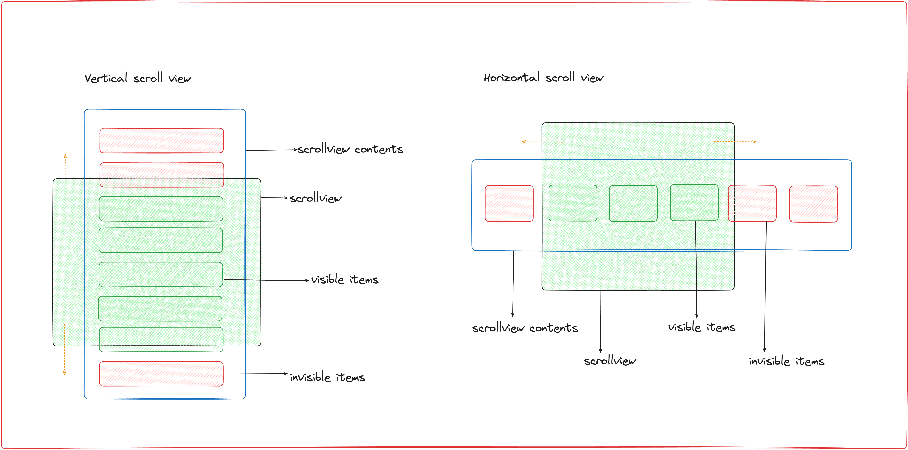

# Scroll Viewport Tracker

A high-performance utility for tracking elements inside a scrollable view in React Native.&#x20;



## Supported Components

- `ScrollView`
- `FlatList`
- `SectionList`
- `Animated.ScrollView`, `Animated.FlatList` and `Animated.SectionList` from `react-native`, including `Animated.event` with `useNativeDriver: true`

## Installation

```sh
npm install rn-scroll-viewport-tracker
```

## Usage

```jsx
import {
  ScrollViewPortTracker,
  ScrollViewPortAwareView,
} from 'rn-scroll-viewport-tracker';

<ScrollViewPortTracker>
  <ScrollView>
    <Component1 />

    <ScrollViewPortAwareView
      name="component2"
      onEnterViewport={() => console.log('Component 2 entered viewport')}
      onLeaveViewport={() => console.log('Component 2 left viewport')}
    >
      <Component2 />
    </ScrollViewPortAwareView>

    <Component3 />
  </ScrollView>
</ScrollViewPortTracker>;
```

### Animated scroll views

The tracker works with `onScroll={Animated.event(...)}` whether or not you use the native driver. The native-driven event is passed through unchanged, so your animation keeps running on the UI thread.

```jsx
const scrollY = useRef(new Animated.Value(0)).current;

<ScrollViewPortTracker>
  <Animated.FlatList
    data={data}
    renderItem={renderItem}
    onScroll={Animated.event(
      [{ nativeEvent: { contentOffset: { y: scrollY } } }],
      { useNativeDriver: true }
    )}
  />
</ScrollViewPortTracker>;
```

## API Reference

### `<ScrollViewPortTracker />`

Tracks elements within a scrollable view and triggers visibility events.

| Prop Name             | Type    | Default | Description                                                       |
| --------------------- | ------- | ------- | ----------------------------------------------------------------- |
| `minOverlapRatio`     | number  | `0.2`   | The minimum overlap ratio required to trigger enter/leave events. |
| `disableTracking`     | boolean | `false` | Disables viewport tracking.                                       |
| `scrollEventThrottle` | number  | `200`   | Sets the throttle rate for scroll events (in milliseconds).       |

### `<ScrollViewPortAwareView />`

Tracks the visibility of an individual element within a scrollable view.

| Prop Name         | Type     | Description                                              |
| ----------------- | -------- | -------------------------------------------------------- |
| `name`            | string   | A unique identifier for the element.                     |
| `onEnterViewport` | function | Callback triggered when the element enters the viewport. |
| `onLeaveViewport` | function | Callback triggered when the element leaves the viewport. |

### Ref Methods

#### `reNotifyVisibleItems()`

Manually triggers the `onEnterViewport` callback for all currently visible items.

## Contributing

Contributions are welcome! Please refer to the Contributing Guide for details on how to get involved.

## License

This project is licensed under the MIT License.

---

Built with [create-react-native-library](https://github.com/callstack/react-native-builder-bob), inspired by [`@skele/components`](https://github.com/netceteragroup/skele/tree/master/packages/components).
